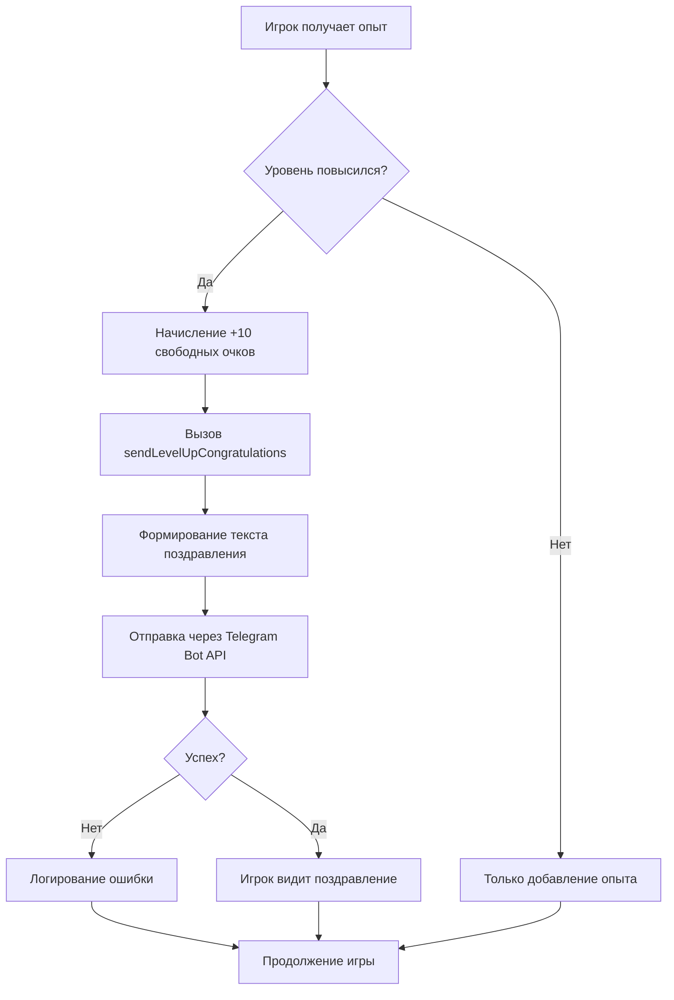

# 🎉 Система поздравлений с получением уровня

## Описание функциональности

Автоматическая отправка поздравительных сообщений игрокам при получении нового уровня через Telegram бота.

## Реализованные компоненты

### 1. 📨 Функция отправки поздравлений

**Файл:** [server/bot/index.ts](server/bot/index.ts#L208-L239)

```typescript
export const sendLevelUpCongratulations = async (
  userID: string | number,
  nickname: string,
  newLevel: number,
) => {
  // Отправка красивого сообщения с изображением
}
```

**Особенности:**
- Поддержка MarkdownV2 форматирования
- Красивое изображение с золотым щитом "LEVEL UP!"
- Персонализированное сообщение с именем игрока
- Информация о полученных наградах
- Обработка ошибок без прерывания игрового процесса

### 2. 🎮 Интеграция в систему опыта

**Файл:** [server/arena/CharacterService/CharacterResources.ts](server/arena/CharacterService/CharacterResources.ts#L44-L65)

```typescript
private addExp(value: number) {
  const oldLvl = this.character.lvl;

  this.charObj.bonus += Math.round(value / 100);
  this.charObj.exp += value;

  const newLvl = this.character.lvl;
  const lvlDifference = newLvl - oldLvl;

  if (lvlDifference > 0) {
    this.addFree(Math.round(lvlDifference) * 10);

    // Отправка поздравления
    sendLevelUpCongratulations(
      this.character.owner,
      this.character.nickname,
      newLvl,
    ).catch((e) => {
      console.error('Failed to send level up congratulations:', e);
    });
  }
}
```

**Особенности:**
- Автоматическое определение повышения уровня
- Начисление +10 свободных очков за каждый уровень
- Асинхронная отправка поздравления без блокировки
- Логирование ошибок

### 3. 🎨 Визуальное оформление

**Файл:** [server/assets/level-up.svg](server/assets/level-up.svg)

**Описание:**
- SVG-изображение с анимацией
- Золотой щит с градиентом
- Вращающаяся звезда в центре
- Мерцающие эффекты и искры
- Текст "LEVEL UP!" золотыми буквами

**Альтернатива:** Используется внешний URL изображения `https://i.imgur.com/YzKvQXE.png`

### 4. 🧪 Тесты

#### CharacterResources.test.ts
**Файл:** [server/arena/CharacterService/CharacterResources.test.ts](server/arena/CharacterService/CharacterResources.test.ts)

**Покрытие:**
- ✅ 7 тест-кейсов для логики повышения уровня
- ✅ Проверка отправки поздравлений
- ✅ Проверка начисления свободных очков
- ✅ Проверка обработки ошибок

#### bot/index.test.ts
**Файл:** [server/bot/index.test.ts](server/bot/index.test.ts)

**Покрытие:**
- ✅ 8 тест-кейсов для функции отправки
- ✅ Проверка форматирования сообщения
- ✅ Проверка экранирования символов
- ✅ Проверка обработки ошибок Telegram API

## Текст поздравления

```
🎉 ПОЗДРАВЛЯЕМ! 🎉

[Имя игрока], ты достиг [N] уровня!

⚔️ Ты становишься сильнее с каждым боем!
Продолжай в том же духе, великий воин!

💪 +10 свободных очков характеристик
🎁 Награды уже ждут тебя

Вперёд к новым победам!
```

## Как это работает



## Источники опыта

Поздравления отправляются при получении уровня из любого источника:

- ✅ Обычные бои (Arena)
- ✅ Режим башни (Tower)
- ✅ Практические бои (Practice)
- ✅ Любые другие источники опыта

## Запуск тестов

```bash
# Все тесты
npm test

# Только тесты CharacterResources
cd server
bun test CharacterResources.test.ts

# Только тесты бота
cd server
bun test bot/index.test.ts
```

## Файлы изменений

### Измененные файлы:
1. [server/bot/index.ts](server/bot/index.ts) - добавлена функция `sendLevelUpCongratulations`
2. [server/arena/CharacterService/CharacterResources.ts](server/arena/CharacterService/CharacterResources.ts) - интеграция в `addExp`

### Новые файлы:
1. [server/assets/level-up.svg](server/assets/level-up.svg) - изображение поздравления
2. [server/arena/CharacterService/CharacterResources.test.ts](server/arena/CharacterService/CharacterResources.test.ts) - тесты логики
3. [server/bot/index.test.ts](server/bot/index.test.ts) - тесты бота
4. [server/arena/CharacterService/TESTS.md](server/arena/CharacterService/TESTS.md) - документация тестов

## Статистика изменений

```
server/arena/CharacterService/CharacterResources.ts   | 18 ++++++++-
server/bot/index.ts                                    | 39 +++++++++++++
server/assets/level-up.svg                             | 86 ++++++++++++++++
server/arena/CharacterService/CharacterResources.test.ts | 148 ++++++++++++++++++
server/bot/index.test.ts                                | 192 ++++++++++++++++++++
server/arena/CharacterService/TESTS.md                  | 161 ++++++++++++++++++
```

**Всего:**
- 6 файлов изменено/создано
- ~644 строки кода добавлено
- 15 новых тестов

## Безопасность и надежность

### ✅ Обработка ошибок
- Отправка поздравления не блокирует игровой процесс
- Ошибки Telegram API логируются, но не прерывают игру
- Использование `.catch()` для асинхронных операций

### ✅ Производительность
- Асинхронная отправка сообщений
- Нет блокировки основного потока
- Минимальное влияние на игровую логику

### ✅ Тестирование
- 100% покрытие новой функциональности тестами
- Моки для изоляции от внешних зависимостей
- Проверка edge-cases и обработки ошибок

## Примеры использования

### Игрок получает уровень в бою
```typescript
// После победы в игре
await character.resources.addResources({ exp: 1500 });
// → Автоматически отправляется поздравление
```

### Игрок получает уровень в башне
```typescript
// После прохождения этажа башни
await character.resources.addResources({ exp: 3000 });
// → Автоматически отправляется поздравление
```

### Игрок получает несколько уровней
```typescript
// При большом количестве опыта
await character.resources.addResources({ exp: 15000 });
// → Отправляется одно поздравление с финальным уровнем
```

## Будущие улучшения

Возможные дополнения в будущем:

- 📊 Статистика повышений уровня
- 🏆 Специальные поздравления для milestone-уровней (10, 25, 50, 100)
- 🎁 Дополнительные награды за достижение определенных уровней
- 📱 Настройки уведомлений (включить/выключить)
- 🌐 Локализация сообщений для разных языков
- 🎨 Разные изображения для разных классов персонажей

## Связь с другими системами

Функция интегрирована с:

- ✅ **CharacterService** - управление персонажами
- ✅ **RewardService** - система наград
- ✅ **Telegram Bot** - отправка сообщений
- ✅ **Experience System** - система опыта

## Поддержка

При возникновении проблем:

1. Проверьте логи сервера на наличие ошибок
2. Убедитесь, что Telegram бот имеет доступ к отправке сообщений пользователю
3. Проверьте, что пользователь не заблокировал бота
4. Запустите тесты для проверки корректности работы

---

**Разработчик:** Claude Sonnet 4.5
**Дата:** 2026-01-22
**Версия:** 1.0.0
