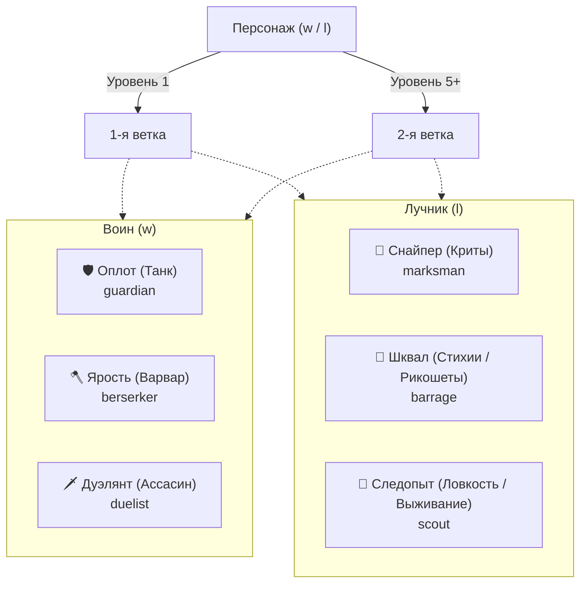

# Боевые умения и навыки: Воин и Лучник

Документация активных умений (`skills`), мастерства оружия (`weaponMastery`) и пассивных боевых талантов (`passiveSkills`) для физических классов — **Воина (`w`)** и **Лучника (`l`)**.

> Связанные документы:
> - [`docs/agents/magic-system.md`](magic-system.md) — Магическая система (Маг и Жрец)
> - [`docs/specs/magic-branches-plan.md`](../specs/magic-branches-plan.md) — Система веток специализации магий
> - [`docs/agents/subclasses.md`](subclasses.md) — 16 комбинаций подклассов улучшения класса и их навыки

---

## 1. Архитектура и компоненты

| Компонент / Слой | Путь | Назначение |
|---|---|---|
| Конструктор активных умений | `server/arena/Constuructors/SkillConstructor.ts` | Базовый класс активных умений с расходом энергии (`en`) |
| Конструктор пассивных навыков | `server/arena/Constuructors/PassiveSkillConstructor.ts` | Базовый класс пассивок, реагирующих на триггеры хуков эффектов |
| Активные умения | `server/arena/skills/` | Реализации: `parry`, `shieldBlock`, `dodge`, `disarm`, `berserk`, `aimedShot`, `piercingShot`, `cripplingShot`, `doubleShot`, `fireArrow`, `poisonArrow`, `step`, `help`, `beastCall`, `terrifyingHowl` |
| Мастерство оружия | `server/arena/weaponMastery/` | 6 типов владения оружием: `thrust`, `cut`, `chop`, `range`, `stun`, `healing` |
| Пассивные навыки | `server/arena/passiveSkills/` | Боевые таланты: `huntersMark`, `eagleEye`, `momentum`, `fieldMedic`, `survivalInstinct`, `ricochet`, `lacerate`, `sweepingBlow`, `consussion`, `nineLives` и др. |
| Сервис умений | `server/arena/SkillService.ts` | Изучение и валидация активных скиллов (`learnSkill`, `getSkillListByProf`) |
| Сервис пассивок | `server/arena/PassiveSkillService.ts` | Изучение пассивных умений и оружейного мастерства (`learnPassiveSkill`) |
| HTTP API | `server/server/skill.ts` | Эндпоинты `/skill/available`, `/skill/:id` |
| Клиентский UI | `client/src/routes/(app)/character/skills/`<br>`client/src/routes/(app)/character/passiveSkills/` | Экраны прокачки активных и пассивных умений за бонусы 💡 |

---

## 2. Сравнительный анализ: Классическая FWO vs fwo-tg

### 2.1. Активные классовые умения

| Умение | Код | Классы и уровень в FWO | Статус в fwo-tg | Реализация в коде | Отличия и состояние |
|---|---|---|---|---|---|
| **Парирование** (`parry`) | `pa` | Воин (ур. 1) | ✅ **Реализовано** | `server/arena/skills/parry.ts` | 6 уровней прокачки (`bonusCost: [10, 20, 30, 40, 60, 80]`). Снижает урон на `dex * effect`, при остатке > 0 полностью парирует атаку оружием ближнего боя. |
| **Блок щитом** (`shieldBlock`) | `sh` | Воин (ур. 2), Маг/Жрец (ур. 5), Лучник (ур. 6) | ⚠️ **Частично** (только Воин) | `server/arena/skills/shieldBlock.ts` | В коде `profList: { w: 4 }` (доступно Воину с 4 ур.). Требует щит в `offHand`. Поглощает удары емкостью блока и временно повышает магзащиту. |
| **Увёртка** (`dodge`) | `do` | Лучник (ур. 2) | ✅ **Реализовано** | `server/arena/skills/dodge.ts` | `profList: { l: 2 }`. 6 уровней прокачки. Шанс полного уворота от атак колющим, режущим, рубящим, метательным, оглушающим оружием на основе ловкости. |
| **Обезоруживание** (`disarm`) | `di` | Воин (ур. 3), Лучник (ур. 5) | ✅ **Реализовано** | `server/arena/skills/disarm.ts` | `profList: { w: 3, l: 5 }`. 6 уровней. Сравнивает ловкость инициатора и цели. При успехе цель теряет возможность бить оружием в раунде. |
| **Берсерк** (`berserk`) | `be` | Воин (ур. 5) | ✅ **Реализовано** | `server/arena/skills/berserk.ts` | В коде `profList: { w: 4 }`. Увеличивает максимальный урон (`hit.max * effect`), но срезает атаку и магзащиту (`1/effect`). |
| **Броня** (`armor`) | `pt` | Воин (ур. 5) | ❌ **Не реализовано** | — | В коде есть общее действие союзной защиты `protect` (`actions/protect.ts`), но нет отдельного классового скилла воина на селф-броню. |
| **Спасение** (`help`) | `he` | Лучник (ур. 6), Воин (ур. 7) | ✅ **Реализовано** | `server/arena/skills/help.ts` | `profList: { w: 3, l: 6 }`. На союзника (`OrderType.TeamExceptSelf`). Прикрывает выбранного соратника, перенаправляя физ. урон по нему на себя со снижением на 15–35%. |
| **Наложение рук** (`cure`) | `cu` | Лучник (ур. 7) | ⚠️ **Базовое действие** | `server/arena/actions/handsHeal.ts` | В коде реализовано как `handsHeal` («Лечение руками»), базовое действие 0 уровня. |
| **Подножка** (`step`) | `st` | Лучник (ур. 8) | ✅ **Реализовано** | `server/arena/skills/step.ts` | `profList: { l: 3 }`. 6 уровней (`levels: [0.6, 0.55, 0.5, 0.45, 0.4, 0.35]`). На цель (`OrderType.Enemy`). Срезает Защиту (`wpr * level`) на 40–65% и Атаку (`wat * (level + 0.2)`) на 20–45% в текущем раунде. Расход: 8–13 EN. |
| **Прицельный выстрел** (`aimedShot`) | `as` | Лучник | ✅ **Реализовано** | `server/arena/skills/aimedShot.ts` | `profList: { l: 2 }`. Селф-бафф (`OrderType.Self`): усиливает урон (`x1.25..x1.5`), снимает и игнорирует увёртку цели (`dodge`), гарантируя попадание. Расход: 10–14 EN, proc: 20%. |
| **Бронебойный выстрел** (`piercingShot`) | `ps` | Лучник | ✅ **Реализовано** | `server/arena/skills/piercingShot.ts` | `profList: { l: 3 }`. Селф-бафф (`OrderType.Self`): пробивает блок щитом (`shieldBlock`), игнорирует 40–80% брони цели (`phys.defence`). Расход: 12–16 EN. |
| **Выстрел в колено** (`cripplingShot`) | `cs` | Лучник | ✅ **Реализовано** | `server/arena/skills/cripplingShot.ts` | `profList: { l: 2 }`. Селф-бафф (`OrderType.Self`): сбивает увёртку, снижает ловкость цели на 25–45% и блокирует уклонение на 2 раунда (*«Когда-то и меня вела дорога приключений...»*). Расход: 12–16 EN. |
| **Залп стрел** (`doubleShot`) | `ds` | Лучник | ✅ **Реализовано** | `server/arena/skills/doubleShot.ts` | `profList: { l: 2 }`. Селф-бафф (`OrderType.Self`): при выстреле лучник выпускает дополнительную стрелу во вторую цель (или ту же) на 60–90% урона. Расход: 12–16 EN, proc: 30%. |
| **Зажигательная стрела** (`fireArrow`) | `fa` | Лучник | ✅ **Реализовано** | `server/arena/skills/fireArrow.ts` | `profList: { l: 3 }`. Селф-бафф (`OrderType.Self`): добавляет урон огнем к выстрелу и накладывает горение `burning` на цель на 2 раунда. Расход: 12–16 EN. |
| **Отравленная стрела** (`poisonArrow`) | `pa` | Лучник | ✅ **Реализовано** | `server/arena/skills/poisonArrow.ts` | `profList: { l: 3 }`. Селф-бафф (`OrderType.Self`): добавляет урон ядом к выстрелу и накладывает отравление `poison` на цель на 2 раунда. Расход: 12–16 EN. |

---

### 2.2. Мастерство оружия (Weapon Mastery)

Все 6 типов оружия из классики FWO **полностью реализованы** в папке `server/arena/weaponMastery/` и доступны для изучения через `PassiveSkillService`.

Каждый навык имеет **6 уровней прокачки** со стоимостью:
`bonusCost: [30, 60, 90, 120, 150, 180]` (суммарно 630 бонусов).

| Навык | Файл | Тип оружия | Эффект по уровням (1–6) | Механика в бою |
|---|---|---|---|---|
| **Колющее** (`thrustWeapon`) | `thrustWeapon.ts` | `thrust` (шпаги, копья) | Шанс: `[55, 60, 65, 70, 75, 80]%`<br>Эффект: `[3, 6, 9, 12, 15, 18]` | Снижает шанс уворота (`dodge`) и промаха (`miss`) противника. |
| **Режущее** (`cutWeapon`) | `cutWeapon.ts` | `cut` (мечи, кинжалы) | Шанс: `[5, 10, 15, 20, 25, 30]%`<br>Эффект: `[3, 6, 9, 12, 15, 18]` | Повышает шанс пробития защиты (`protect`). |
| **Рубящее** (`chopWeapon`) | `chopWeapon.ts` | `chop` (топоры, секиры) | Шанс: `[5, 10, 15, 20, 25, 30]%`<br>Эффект: `+3, +6, +9, +12, +15, +18` | Напрямую увеличивает наносимый физический урон при атаке. |
| **Дальнобойное** (`rangeWeapon`) | `rangeWeapon.ts` | `range` (луки, арбалеты) | Шанс: `[55, 60, 65, 70, 75, 80]%`<br>Эффект: `[3, 6, 9, 12, 15, 18]` | Снижает вероятность промаха (`miss`) и уворота (`dodge`) цели от выстрела. |
| **Оглушающее** (`stunWeapon`) | `stunWeapon.ts` | `stun` (молоты, булавы, дубины) | Шанс: `[5, 10, 15, 20, 25, 30]%`<br>Эффект: `[3, 6, 9, 12, 15, 18]` | Повышает шанс пробития вражеской защиты (`protect`). |
| **Лечащее** (`healingWeapon`) | `healingWeapon.ts` | `heal` (лечебные посохи) | Шанс: `[5, 10, 15, 20, 25, 30]%`<br>Эффект: `+3, +6, +9, +12, +15, +18` | Повышает лечебный эффект оружия при ударе/исцелении. |

---

### 2.3. Боевые пассивные таланты (Passive Skills)

В `fwo-tg` создана система оружейных и классовых пассивок (`server/arena/passiveSkills/`), активирующихся через событийные хуки движка боя:

| Пассивка | Файл | Привязка | Шанс / Эффект | Описание механики |
|---|---|---|---|---|
| **🎯 Метка охотника** (`huntersMark`) | `huntersMark.ts` | Дальнобойное оружие (`range`) | Шанс: `[33, 50, 75]%`<br>Урон: `+10%, +25%, +50%` | При успешном выстреле вешает на цель метку на 2 хода. Следующая атака по цели наносит увеличенный урон (`markedShot`). |
| **🦅 Орлиный глаз** (`eagleEye`) | `eagleEye.ts` | Дальнобойное оружие (`range`) | Шанс: `[60, 75, 90]%` | Замена мастерства оружия: снижает шанс промаха (`miss`) при стрельбе из лука или арбалета. |
| **⚡ Кураж** (`momentum`) | `momentum.ts` | Дальнобойное оружие (`range`) | Энергия: `+2, +3, +5`<br>Урон: `+5%` за стак | Заменил `secondAttack`. Каждое попадание восстанавливает энергию и дает стак куража (до 3 стаков, +5% физ. урона каждый). |
| **💚 Полевой медик** (`fieldMedic`) | `fieldMedic.ts` | Выживание / Следопыт | Хил: `+30%, +45%, +60%`<br>Анти-срыв: `100%` | Заменил `smokeScreen`. Усиливает «Лечение руками» на 30–60% и полностью предотвращает срыв лечения вражескими физ. атаками. |
| **🛡️ Инстинкт выживания** (`survivalInstinct`) | `survivalInstinct.ts` | Выживание | Снижение: `[20, 30, 40]%` | При падении здоровья ниже 35% весь получаемый урон снижается на указанный процент. |
| **🔀 Рикошет** (`ricochet`) | `ricochet.ts` | Дальнобойное оружие (`range`) | Шанс: `[30, 45, 60]%`<br>Урон: `50%, 60%, 70%` | При выстреле стрела с вероятностью отскакивает во 2-го врага, нанося часть урона. |
| **🩸 Рассечение** (`lacerate`) | `lacerate.ts` | Режущее оружие (`cut`) | Шанс: `[15, 20, 30]%` | При физ. атаке накладывает на цель длительный эффект `bleeding` (DoT-кровотечение). |
| **💥 Размашистый удар** (`sweepingBlow`) | `sweepingBlow.ts` | Режущее оружие (`cut`) | Шанс: `[10, 25, 50]%`<br>Урон: `25%, 50%, 75%` | При ударе по цели наносит дополнительный урон случайному соратнику цели (клив/сплеш-атака). |
| **Сотрясение** (`consussion`) | `consussion.ts` | Дробящее оружие (`stun`) | Шанс: `[10, 15, 25]%` | При атаке оглушает цель эффектом `stun`, блокируя её следующее действие в раунде. |
| **🐱 Девять жизней** (`nineLives`) | `nineLives.ts` | Пассивное выживание | Шанс: `[10, 20, 33]%` | 1 раз за бой при получении смертельного урона оставляет персонажу `0.05 HP`. |
| **🔔 Целебный боньк** (`healBonk`) | `healBonk.ts` | Лечащее оружие (`heal`) | Шанс: `[50, 75, 100]%`<br>Хил: `50%, 100%, 200%` | Удар посохом исцеляет случайного союзника на процент от нанесенного урона. |
| **Статичная защита** (`staticProtect`) | `staticProtect.ts` | Броня | Расчет от `attack / static.defence` | Пассивный шанс заблокировать атаку без заказа действия защиты. |
| **Промах судьбы** (`fatesMiss`) | `fatesMiss.ts` | Базовая механика | Шанс: `5%` | Случайный срыв физ. атаки по воле судьбы. |

---

### 2.4. Таланты из FWO, ожидающие реализации

1. **Второе оружие (`2nd_weapon`, Воин)**:
   - В FWO даёт шанс дополнительного бонуса к атаке одноручным оружием (дуал-вилд).
2. **Сила воли (`power`, Все классы)**:
   - Позволяет наносить удары даже при активном заклинании жреца «Затмение».
3. **Регенерации (`hp_regen`, `en_regen`)**:
   - Пассивная прокачка постоянного восполнения HP и энергии каждый раунд.
4. **Ремесло (`blacksmith`, `creator`)**:
   - Кузнечное дело (ковка экипировки и слитков).

---

## 3. Детальный разбор активных умений

### 3.1. Парирование (`parry`)
- **Класс**: Воин (`w: 1`).
- **Порядок в раунде**: Стадия `parry` (выполняется до атаки).
- **Стоимость энергии**: `[8, 9, 10, 11, 12, 13] EN`.
- **Шанс успеха**: `[70, 75, 80, 85, 90, 95]%`.
- **Множитель ловкости (`effect`)**: `[1.1, 1.2, 1.3, 1.4, 1.5, 1.6]`.
- **Формула**:
  ```typescript
  value = initiator.dex * effect;
  // При получении физ. урона холодным оружием (thrust, cut, chop, stun):
  affect.value -= enemy.dex;
  if (affect.value > 0) {
    // Удар успешно парирован! Атака противника прерывается CastError
  }
  ```

### 3.2. Блок щитом (`shieldBlock`)
- **Класс**: Воин (`w: 4`).
- **Требование**: Экипированный щит в слоте `offHand`.
- **Стоимость энергии**: `[8, 9, 10, 11, 12, 13] EN`.
- **Емкость блока**:
  ```typescript
  shieldCapacity = (0.3 * str + 0.7 * con + 0.25 * shield.defence) * effect;
  ```
- **Особенности**:
  - Пока действует щит, персонаж получает бонус к **магической защите** (`magic.defence += shieldCapacity`).
  - Каждый удар врага истощает прочность блока на `(0.7 * enemy.str + 0.3 * enemy.con) * proc`.
  - Если емкость блока исчерпана — блок спадает.

### 3.3. Увёртка (`dodge`)
- **Класс**: Лучник (`l: 2`).
- **Стоимость энергии**: `[10, 12, 14, 16, 18, 20] EN`.
- **Шанс применения**: `[75, 80, 85, 90, 95, 99]%`.
- **Формула шанса уворота от атаки**:
  ```typescript
  dodgeValue = effect * initiator.dex;
  dodgeFactor = Math.round(dodgeValue / enemy.dex);
  chance = Math.round(Math.sqrt(dodgeFactor) + 10 * dodgeFactor + 5);
  // При chance > d100 атака противника срывается!
  ```
- Защищает от любого оружия, кроме безоружного и специфической магии.

### 3.4. Обезоруживание (`disarm`)
- **Классы**: Воин (`w: 3`), Лучник (`l: 5`).
- **Тип заказа**: `OrderType.Enemy` (направлено на конкретного противника).
- **Стоимость энергии**: `[12, 13, 14, 15, 16, 17] EN`.
- **Формула успеха**:
  ```typescript
  if (initiator.dex * effect >= target.dex) {
    // Цель обезоружена: ее физ. атака оружием в этом раунде отменяется
  }
  ```

### 3.5. Берсерк (`berserk`)
- **Класс**: Воин (`w: 4`).
- **Стоимость энергии**: `[8, 9, 10, 11, 12, 13] EN`.
- **Эффект множителя**: `[1.1, 1.2, 1.3, 1.4, 1.5, 1.6]`.
- **Модификаторы характеристик в раунде**:
  - `hit.max = hit.max * effect` (рост предельного урона оружия).
  - `phys.attack = phys.attack / effect` (снижение вероятности попадания).
  - `magic.defence = magic.defence / effect` (уязвимость к магии).

### 3.6. Прицельный выстрел (`aimedShot`)
- **Класс**: Лучник (`l: 2`), ветка `marksman`.
- **Тип заказа**: `OrderType.Self` (селф-бафф на следующий выстрел).
- **Требование**: Оружие дальнего боя (`range`).
- **Стоимость энергии**: `[10, 12, 14] EN`.
- **Доля хода (proc)**: `20%` (ограничивает остаток proc на атаку при комбинировании умений).
- **Шанс успеха**: `[85, 90, 95]%`.
- **Эффект множителя урона**: `[1.25, 1.35, 1.5]`.
- **Механика**: В раунде вешает на лучника эффект `onBeforeDamageDeal`. При совершении обычной физической атаки оружием дальнего боя увеличивает наносимый урон в `1.25..1.5` раза и **снимает/игнорирует увёртку цели** (`dodge`), гарантируя попадание.

### 3.7. Бронебойный выстрел (`piercingShot`)
- **Класс**: Лучник (`l: 3`), ветка `marksman`.
- **Тип заказа**: `OrderType.Self` (селф-бафф на следующий выстрел).
- **Требование**: Оружие дальнего боя (`range`).
- **Стоимость энергии**: `[12, 14, 16] EN`.
- **Шанс успеха**: `[75, 85, 95]%`.
- **Эффект пробития**: `[40, 60, 80]%`.
- **Механика**: В раунде вешает на лучника эффект `onBeforeDamageDeal`. При атаке дальнего боя **пробивает блок щитом** (`shieldBlock`), снижает физ. защиту цели (`phys.defence`) на 40–80% и добавляет умеренный бонусный урон.

### 3.8. Выстрел в колено (`cripplingShot`)
- **Класс**: Лучник (`l: 2`), ветка `marksman`.
- **Тип заказа**: `OrderType.Self` (селф-бафф на следующий выстрел).
- **Требование**: Оружие дальнего боя (`range`).
- **Стоимость энергии**: `[12, 14, 16] EN`.
- **Шанс успеха**: `[80, 85, 90]%`.
- **Эффект снижения ловкости**: `[25, 35, 45]%`.
- **Цитата**: *«Когда-то и меня вела дорога приключений, а потом мне прострелили колено...»*
- **Механика**: Сбивает текущую увёртку цели, наносит урон, снижает ловкость цели на 25–45% и вешает долгий эффект на 2 раунда, блокирующий возможность использовать «Увёртку» (`dodge`).

### 3.9. Залп стрел (`doubleShot`)
- **Класс**: Лучник (`l: 2`), ветка `barrage`.
- **Тип заказа**: `OrderType.Self` (селф-бафф на следующий выстрел).
- **Требование**: Оружие дальнего боя (`range`).
- **Стоимость энергии**: `[12, 14, 16] EN`.
- **Доля хода (proc)**: `30%` (совместный заказ с `aimedShot` оставляет не более 50% proc на атаку/защиту).
- **Шанс успеха**: `[80, 85, 90]%`.
- **Урон второй стрелы**: `[60, 75, 90]%`.
- **Механика**: В раунде вешает на лучника эффект `onDamageDealt`. При попадании выстрела выпускает вторую стрелу во вторую живую вражескую цель (или ту же цель при отсутствии других врагов), нанося 60–90% урона.

### 3.10. Зажигательная стрела (`fireArrow`)
- **Класс**: Лучник (`l: 3`), ветка `barrage`.
- **Тип заказа**: `OrderType.Self` (селф-бафф на следующий выстрел).
- **Требование**: Оружие дальнего боя (`range`).
- **Стоимость энергии**: `[12, 14, 16] EN`.
- **Шанс успеха**: `[80, 85, 90]%`.
- **Эффект горения / урон**: `[20, 30, 40]`.
- **Механика**: В раунде вешает на лучника эффект `onBeforeDamageDeal` (добавляет к выстрелу урон огнём) и `onDamageDealt` (накладывает на цель эффект периодического урона `burning` на 2 раунда).

### 3.11. Отравленная стрела (`poisonArrow`)
- **Класс**: Лучник (`l: 3`), ветка `barrage`.
- **Тип заказа**: `OrderType.Self` (селф-бафф на следующий выстрел).
- **Требование**: Оружие дальнего боя (`range`).
- **Стоимость энергии**: `[12, 14, 16] EN`.
- **Шанс успеха**: `[80, 85, 90]%`.
- **Эффект яда / периодический урон**: `[20, 30, 40]`.
- **Механика**: В раунде вешает на лучника эффект `onBeforeDamageDeal` (добавляет к выстрелу урон кислотой/ядом) и `onDamageDealt` (накладывает на цель эффект периодического урона `poison` на 2 раунда).

### 3.12. Подножка (`step`)
- **Класс**: Лучник (`l: 3`), ветка `scout`.
- **Тип заказа**: `OrderType.Enemy` (направлено на врага).
- **Стоимость энергии**: `[8, 9, 10, 11, 12, 13] EN`.
- **Шанс успеха**: `[70, 75, 80, 85, 90, 95]%`.
- **Коэффициенты уровня (`levels`)**: `[0.6, 0.55, 0.5, 0.45, 0.4, 0.35]`.
- **Механика срезания характеристик в текущем раунде**:
  - Защита цели: `wpr = wpr * level` (снижение на 40–65%).
  - Атака цели: `wat = wat * (level + 0.2)` (снижение на 20–45%).

### 3.13. Спасение (`help`)
- **Класс**: Воин (`w: 3`), Лучник (`l: 6`), ветки `guardian` и `scout`.
- **Тип заказа**: `OrderType.TeamExceptSelf` (на выбранного союзника).
- **Стоимость энергии**: `[10, 12, 14] EN`.
- **Шанс успеха**: `[80, 90, 100]%`.
- **Снижение входящего урона**: `[15, 25, 35]%`.
- **Механика**: Вешает на союзника защиту на 1 раунд. Весь входящий физический урон по союзнику перехватывается заклинателем со снижением на 15–35%.

---

## 4. Истинные пассивные навыки подклассов (Улучшение класса)

Для комбинаций Воина и Лучника в системе улучшения класса (подробнее см. [`docs/agents/subclasses.md`](subclasses.md)) предусмотрены истинные пассивные навыки:

| Подкласс | Код | Базовые классы | Истинный навык | Механика |
|---|---|---|---|---|
| **Варвар** | `ww` | Воин + Воин | **Пробивной удар** (`double_strike`)<br>**Рукопашный бой** (`melee_attack`) | До +35% шанс увеличить урон на +50%<br>Повышает свою атаку и режет защиту цели |
| **Ассасин** | `wl` | Воин + Лучник | **Ядовитое оружие** (`poisonus_weapon`)<br>**Фатальный выстрел** (`fatal_shot`) | Отравление выстрелом на 20–30% урона<br>Мгновенная гибель цели при атаке от 70% мощности |
| **Снайпер** | `ll` | Лучник + Лучник | **Меткий выстрел** (`neat_shot`) | Выстрел игнорирует любые блоки, щиты и увороты |
| **Рейнджер** | `ml` | Маг + Лучник | **Уклонение от магии** (`mag_evasion`)<br>**Уклонение от ударов** (`phys_evasion`) | Шанс избежать направленного заклинания<br>Шанс избежать физ. удара |
| **Тамплиер** | `mw` | Маг + Воин | **Кровавый удар** (`blood_strike`) | Добивание цели смертью от кровопотери, если HP < 20% |
| **Инквизитор** | `pw` | Жрец + Воин | **Оглушающий удар** (`deaf_strike`)<br>**Регенерация** (`ability_regen`) | Оглушение дробящим оружием на следующий раунд<br>Прирост HP и энергии в бою |
| **Назгул** | `pl` | Жрец + Лучник | **Пить жизнь** (`drink_life`)<br>**Кровавый выстрел** (`blood_shot`) | Вампиризм выстрелом (20–30% урона в HP)<br>Кровотечение цели на 5 раундов |
| **Элементалист**| `wm` | Воин + Маг | **Подчинение стихий** (`submission`) | Максимизирует стихийный урон |
| **Друид** | `lm` | Лучник + Маг | **Сила разума** (`reason`) | Каст заклинаний сквозь «Безмолвие» |

---

## 5. Ветки специализации и смешанные деревья (Активные + Пассивные)

По аналогии с магической системой, каждый физический класс получает **3 ветки специализации**. Игрок выбирает **максимум 2 ветки** (1-я на 1-м уровне, 2-я на 5-м уровне). Третья ветка блокируется.

В каждой ветке находятся как **активные умения** (требуют заказа хода и тратят энергию `en`), так и **пассивные таланты** (работают автоматически через хуки боя).



### 5.1. Ветки Лучника (`l`)

В соответствии с концепцией специализаций лучник может выбрать до **2 веток из 3** (1-я ветка доступна на 1-м уровне, 2-я ветка открывается по мере прокачки персонажа).
Каждая ветка Лучника содержит ровно **3 активных умения** и **2 пассивных таланта** (суммарно 9 активных навыков и 6 пассивок на класс).

Большинство активных атакующих умений лучника работают по механике подготовки выстрела (**селф-бафф `OrderType.Self`**): умение активируется в начале раунда и накладывает боевой эффект (`onBeforeDamageDeal` / `onDamageDealt`), модифицирующий базовую атаку дальнего боя. Исключения составляют направленная тактическая **«Подножка»** (`OrderType.Enemy`) и командное **«Спасение»** (`OrderType.TeamExceptSelf`).

```
                              ┌────────────────────────┐
                              │      Лучник (l)        │
                              └───────────┬────────────┘
                ┌─────────────────────────┼─────────────────────────┐
                ▼                         ▼                         ▼
      🎯 Снайпер (marksman)      🏹 Шквал (barrage)        🏃 Следопыт (scout)
  ───────────────────────────── ───────────────────────── ─────────────────────────
  ⚡ Прицельный выстрел (as)   ⚡ Залп стрел (ds)        ⚡ Увёртка (do)
  ⚡ Бронебойный выстрел (ps)  ⚡ Зажигательная стр. (fa) ⚡ Подножка (st)
  ⚡ Выстрел в колено (cs)     ⚡ Отравленная стр. (pa)   ⚡ Спасение (he)
  🛡️ Орлиный глаз (eagleEye)    🛡️ Рикошет (ricochet)     🛡️ Инстинкт выживания (survival)
  🛡️ Метка охотника (mark)     🛡️ Кураж (momentum)       🛡️ Полевой медик (fieldMedic)
```

---

#### 5.1.1. 🎯 Ветка «Снайпер» (`marksman`) — Точечный урон, точность, пробивание защиты

Специализация на дуэлях, уничтожении бронированных «танков» и гарантированном поражении вёртких целей. Нивелирует защитные преимущества противников (увороты, щиты, высокую броню).

| Навык / Способность | Id / Код | Тип | Ур. | EN | Шанс (%) | Эффект по уровням (1–3) | Описание и боевая механика |
|---|---|---|---|---|---|---|---|
| **Прицельный выстрел** | `aimedShot`<br>(`as`) | ⚡ Активное<br>*(Селф-бафф)* | 2 | 10 / 12 / 14<br>*(proc: 20%)* | 85 / 90 / 95 | Урон: `x1.25` / `x1.35` / `x1.50` | Заряжает следующую атаку дальнего боя повышенным уроном. **Полностью игнорирует и снимает увёртку цели** (`dodge`), гарантируя чистое попадание. |
| **Бронебойный выстрел** | `piercingShot`<br>(`ps`) | ⚡ Активное<br>*(Селф-бафф)* | 3 | 12 / 14 / 16 | 75 / 85 / 95 | Пробитие: `40%` / `60%` / `80%`<br>Урон: `+10%` / `+15%` / `+20%` | Заряжает следующую атаку дальнего боя. **Сбивает блок щитом** (`shieldBlock`), срезает физзащиту цели на 40–80% и наносит умеренный доп. урон. |
| **Выстрел в колено** | `cripplingShot`<br>(`cs`) | ⚡ Активное<br>*(Селф-бафф)* | 2 | 12 / 14 / 16 | 80 / 85 / 90 | Срез ловкости: `-25%` / `-35%` / `-45%` | Сбивает увёртку, срезает ловкость цели (`dex`) на 2 раунда и **блокирует использование «Увёртки»** цели на 2 раунда (*«Когда-то и меня вела дорога приключений...»*). |
| **Орлиный глаз** | `eagleEye` | 🛡️ Пассивное | 1 | — | 60 / 75 / 90 | Парирование промаха: `60%` / `75%` / `90%` | При стрельбе из лука/арбалета с высокой вероятностью отменяет промах (`miss` и `fatesMiss`), спасая атаку персонажа. Полноценная замена старого мастерства оружия. |
| **Метка охотника** *(гибрид)* | `huntersMark` | 🛡️ Пассивное | 1 | — | 33 / 50 / 75 | Доп. урон: `+10%` / `+25%` / `+50%` | При успешном выстреле вешает на цель метку на 2 раунда. Входящий физический урон по помеченной цели увеличивается на процент бонуса. |

> 💡 **Синергия ветки**: «Орлиный глаз» предотвращает любые случайные промахи ➔ «Выстрел в колено» лишает мобильного врага ловкости и запрещает уклоняться ➔ «Метка охотника» вешает дебафф на уязвимость ➔ «Прицельный выстрел» и «Бронебойный выстрел» наносят сокрушительный урон сквозь любые щиты и латы.

---

#### 5.1.2. 🏹 Ветка «Шквал» (`barrage`) — Мульти-атаки, стихии (огонь + яд), рикошеты и боевой кураж

Специализация на массовом бое, поражении нескольких врагов одновременно, периодическом уроне двух стихий (огонь и яд/кислота) и устойчивом восполнении энергии прямо во время стрельбы.

| Навык / Способность | Id / Код | Тип | Ур. | EN | Шанс (%) | Эффект по уровням (1–3) | Описание и боевая механика |
|---|---|---|---|---|---|---|---|
| **Залп стрел** | `doubleShot`<br>(`ds`) | ⚡ Активное<br>*(Селф-бафф)* | 2 | 12 / 14 / 16<br>*(proc: 30%)* | 80 / 85 / 90 | Урон 2-й стрелы: `60%` / `75%` / `90%` | При основной физ. атаке лучник выпускает вторую стрелу во второго живого противника (или в того же врага при дуэли 1 на 1), нанося процент от базового урона. |
| **Зажигательная стрела** | `fireArrow`<br>(`fa`) | ⚡ Активное<br>*(Селф-бафф)* | 3 | 12 / 14 / 16 | 80 / 85 / 90 | Бонус урон: `+20` / `+30` / `+40`<br>Горение: `10` / `15` / `20` (2 раунда) | Заряжает атаку огнем: добавляет стихийный урон огнем к выстрелу и поджигает цель эффектом периодического урона `burning` на 2 раунда. |
| **Отравленная стрела** | `poisonArrow`<br>(`pa`) | ⚡ Активное<br>*(Селф-бафф)* | 3 | 12 / 14 / 16 | 80 / 85 / 90 | Бонус урон: `+20` / `+30` / `+40`<br>Яд: `10` / `15` / `20` (2 раунда) | Смазывает стрелу ядом: добавляет урон кислотой к выстрелу и отравляет цель эффектом периодического урона `poison` на 2 раунда. |
| **Рикошет** *(гибрид)* | `ricochet` | 🛡️ Пассивное | 1 | — | 30 / 45 / 60 | Урон рикошета: `50%` / `60%` / `70%` | При любом выстреле стрела с вероятностью отскакивает в случайного союзника цели, нанося процент урона от основной атаки. |
| **Кураж** | `momentum` | 🛡️ Пассивное | 1 | — | 100 | Энергия: `+2` / `+3` / `+5` EN<br>Стаки: до `1` / `2` / `3` (+5% урона/стак) | *(Заменяет `secondAttack`)*. Каждое попадание стрелой восстанавливает энергию и накладывает стак куража (до 3 стаков, до +15% физ. урона), обеспечивая бесконечный цикл стрельбы. |

> 💡 **Синергия ветки**: Два типа DoT («Зажигательная стрела» + «Отравленная стрела») стабильно истощают здоровье цели каждую фазу раунда. «Залп стрел» и пассивный «Рикошет» превращают выстрелы в цепную реакцию по всей вражеской группе, а «Кураж» окупает затраты энергии на постоянное использование стихийных выстрелов.

---

#### 5.1.3. 🏃 Ветка «Следопыт» (`scout`) — Мобильность, уклонение, полевая медицина и тактический контроль

Специализация на личной выживаемости, срыве вражеских планов, защите уязвимых соратников по команде и надёжном полевом исцелении под фокусом врагов.

| Навык / Способность | Id / Код | Тип | Ур. | EN | Шанс (%) | Эффект по уровням | Описание и боевая механика |
|---|---|---|---|---|---|---|---|
| **Увёртка** | `dodge`<br>(`do`) | ⚡ Активное<br>*(Селф-заказ)* | 2 | 10–20<br>*(6 ур.)* | 75–99% | Множитель ловкости: `x1.1..x1.6` | Заказ уворота на раунд. Дает высокий шанс полностью избежать любой направленной атаки холодным или дальнобойным оружием (на основе соотношения ловкости). |
| **Подножка** | `step`<br>(`st`) | ⚡ Активное<br>*(На врага)* | 3 | 8–13<br>*(6 ур.)* | 70–95% | Защита цели: `wpr * [0.60..0.35]`<br>Атака цели: `wat * [0.80..0.55]` | Тактический прием (`OrderType.Enemy`). Срезает Защиту цели на **40–65%** и Атаку цели на **20–45%** в текущем раунде, обезоруживая сильнейшие выпады врага. |
| **Спасение** *(гибрид)* | `help`<br>(`he`) | ⚡ Активное<br>*(На союзника)* | 6 | 10 / 12 / 14<br>*(3 ур.)* | 80 / 90 / 100 | Снижение урона: `15%` / `25%` / `35%` | Командный сейв (`OrderType.TeamExceptSelf`). Перенаправляет весь физ. урон с выбранного союзника на себя со снижением на 15–35%. *(У Воина доступно с 3 ур.)* |
| **Инстинкт выживания** | `survivalInstinct` | 🛡️ Пассивное | 1 | — | 100 | Снижение урона: `20%` / `30%` / `40%` | Страховка от летального урона: когда HP падает ниже 35%, весь входящий урон по персонажу снижается на процент бонуса. |
| **Полевой медик** | `fieldMedic` | 🛡️ Пассивное | 1 | — | 100 | Бонус к хилу: `+30%` / `+45%` / `+60%`<br>Анти-срыв лечения: `100%` | *(Заменяет `smokeScreen`)*. Усиливает базовое действие «Лечение руками» (`handsHeal`) на 30–60% и **полностью предотвращает срыв каста лечения** вражескими физическими ударами. |

*(Примечание: Умение **Обезоруживание** (`disarm`, 5 ур.) также доступно Следопыту как гибрид со специализацией Дуэлянт Воина).*

> 💡 **Синергия ветки**: Высокая ловкость и «Увёртка» защищают персонажа, «Подножка» нейтрализует опаснейшие ходы врагов, «Инстинкт выживания» дает время среагировать при просадке HP, а «Полевой медик» гарантирует, что «Лечение руками» вылечит персонажа или союзника без риска срыва вражескими тычками.

---

#### 5.1.4. Исключённые и переработанные способности Лучника

В ходе редизайна и перебалансировки веток однообразные «урон-клоны» и устаревшие умения были выведены из пула либо переработаны в глубокие механики:

| Способность | Id | Исходный тип | Статус | Причина исключения / Замена |
|---|---|---|---|---|
| **Смертоносный выстрел** | `fatalShot` | ⚡ Активное | 🗑️ **Исключено** | Скучный клон прямого урона без тактического применения. Заменен на тактический дебафф **«Выстрел в колено»** (`cripplingShot`), режущий ловкость и ломающий уклонение. |
| **Град стрел** | `arrowRain` | ⚡ Активное | 🗑️ **Исключено** | Избыточное AoE-умение. Массовый урон перераспределен в сбалансированную связку **«Залп стрел»** (`doubleShot`) + **«Рикошет»** (`ricochet`). |
| **Полевая перевязка** | `fieldMedic` / `cure` | ⚡ Активное | 🗑️ **Исключено** | Активное умение дублировало базовое действие «Лечение руками» (`handsHeal`). Переработано в пассивный талант **«Полевой медик»** (`fieldMedic`), усиливающий `handsHeal` и дающий 100% защиту от срыва физ. атаками. |
| **Вторая атака** | `secondAttack` | 🛡️ Пассивное | 🔄 **Заменено** | Примитивный RNG-прок дополнительной атаки заменен на **«Кураж»** (`momentum`) — генерацию энергии и стакающийся бонус к урону за каждое попадание. |
| **Дымовая завеса** | `smokeScreen` | 🛡️ Пассивное | 🔄 **Заменено** | Рандомный групповой уворот был ненадежным; заменен на гарантированную утилитарную поддержку **«Полевой медик»** (`fieldMedic`). |

---

### 5.2. Ветки Воина (`w`)

#### 1. 🛡️ Оплот / Танк (`guardian`) — Щиты, защита соратников, таунт, стан
- ⚡ **Блок щитом** (`shieldBlock`): активный блок: емкость блока щита поглощает удары, временно повышает магзащиту (уже в коде).
- ⚡ **Спасение** (`help`): активный таунт: принудительно перенаправляет все атаки с выбранного союзника на Воина.
- ⚡ **Удар щитом** (`shieldBash`): активный сокрушительный удар щитом: дробящий урон и шанс 50–75% оглушить цель (`stun`) на 1 ход.
- 🛡️ **Закалённая броня** (`armor`): *пассивный талант*. Постоянный пассивный прирост +20..50% к физической защите (`phys.defence`) и рост статического блока броней.
- 🛡️ **Несокрушимость** (`unyielding`): *пассивный талант*. При падении HP ниже 30% весь получаемый урон снижается на 40%.

#### 2. 🪓 Ярость / Варвар (`berserker`) — Разрушительный урон, сплеш, жертва защитой
- ⚡ **Берсерк** (`berserk`): активная стойка: резкое повышение максимального урона ценой снижения защиты (уже в коде).
- ⚡ **Кровавая ярость** (`bloodRage`): активный прием: воин жертвует 10% своего HP ради баффа +40% к атаке и пробитию брони на 2 раунда.
- ⚡ **Казнь** (`execute`): активный добивающий удар: удваивает урон, если у цели осталось менее 35% HP.
- 🛡️ **Размашистый удар** (`sweepingBlow`): *пассивный талант*. При атаках рубящим оружием топор с вероятностью 25–50% рассекает соседнего врага на 35–75% урона.
- 🛡️ **Жажда битвы** (`bloodlust`): *пассивный талант*. При добивании любого противника воин немедленно восстанавливает 20 энергии и 10% HP.

#### 3. 🗡️ Дуэлянт / Ассасин (`duelist`) — Фехтование, парирование, обезоруживание, кровотечения
- ⚡ **Парирование** (`parry`): активный тактический прием: парирование атак холодного оружия ближнего боя (уже в коде).
- ⚡ **Обезоруживание** (`disarm`): активный тактический прием: выбивает оружие цели при сравнении ловкости (уже в коде).
- ⚡ **Точный выпад** (`vitalStrike`): активный удар в уязвимость сквозь 50% защиты цели; крит x1.75 по оглушенным/обезоруженным.
- 🛡️ **Рассечение** (`lacerate`): *пассивный талант*. Атаки режущим оружием с шансом 20–35% накладывают сильное кровотечение `bleeding` на 3 раунда.
- 🛡️ **Контрудар** (`riposte`): *пассивный талант*. При успешном парировании воин немедленно наносит бесплатный ответный удар по атаковавшему врагу.

---

### 5.3. Гибридные способности (мульти-ветки)

Некоторые умения и таланты входят в состав сразу двух веток специализации, открывая уникальные кросс-ветвевые билды:

| Способность | Id | Тип | Доступные ветки | Примечание |
|---|---|---|---|---|
| **Спасение** | `help` | ⚡ Активное | `['guardian', 'scout']` | Доступно Оплоту (Воин с 3 ур.) и Следопыту (Лучник с 6 ур.) |
| **Обезоруживание** | `disarm` | ⚡ Активное | `['duelist', 'scout']` | Доступно Дуэлянту (Воин с 3 ур.) и Следопыту (Лучник с 5 ур.) |
| **Метка охотника** | `huntersMark` | 🛡️ Пассивное | `['marksman', 'scout']` | Доступно Снайперу и Следопыту (Лучник) |
| **Рикошет** | `ricochet` | 🛡️ Пассивное | `['barrage', 'marksman']` | Доступно Шквалу и Снайперу (Лучник) |
| **Размашистый удар** | `sweepingBlow` | 🛡️ Пассивное | `['berserker', 'duelist']` | Доступно Ярости и Дуэлянту (Воин) |

---

## 6. Механика изучения и респека

1. **Дерево ветки в UI**:
   - Вкладка **«Способности»**: список изученных способностей персонажа (активные и пассивные).
   - Вкладка **«Ветки (N/2)»**: выбор 1-й специализации (с 1 уровня) и 2-й специализации (с 5 уровня).
   - Вкладка **«Изучение»**: дерево/каталог активных веток со стоимостью прокачки за `bonus` 💡, бейджами ⚡ *Активно* / 🛡️ *Пассивно* и метками «гибрид».
2. **Стоимость**:
   - Каждый ранг способности стоит очки бонусов: ранг 1 = 10💡, ранг 2 = 20💡, ранг 3 = 30💡 (максимум 3 ранга).
3. **Сброс умений (Респек)**:
   - Полный сброс изученных умений и веток со 100% возвратом всех потраченных очков бонусов.

