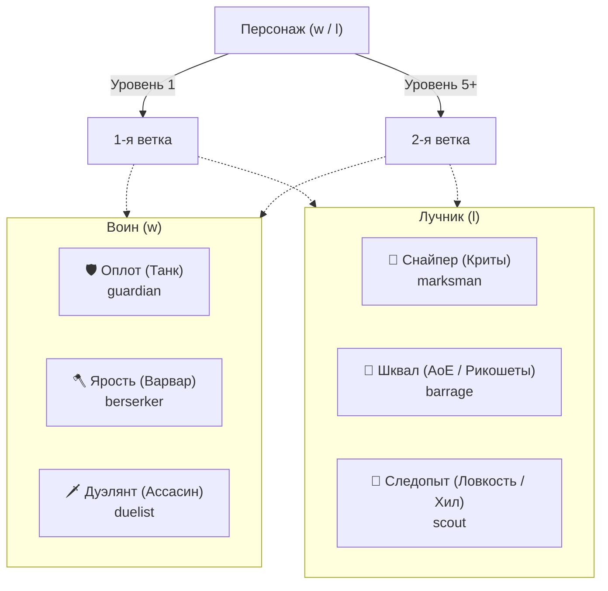

# Боевые умения и навыки: Воин и Лучник

Документация активных умений (`skills`), мастерства оружия (`weaponMastery`) и пассивных боевых талантов (`passiveSkills`) для физических классов — **Воина (`w`)** и **Лучника (`l`)**.

> Связанные документы:
> - [`docs/agents/magic-system.md`](magic-system.md) — Магическая система (Маг и Жрец)
> - [`docs/specs/magic-branches-plan.md`](../specs/magic-branches-plan.md) — Система веток специализации магий
> - [`docs/agents/subclasses.md`](subclasses.md) — 16 комбинаций подклассов улучшения класса и их навыки

---

## 1. Архитектура и компоненты

| Компонент / Слой | Путь | Назначение |
|---|---|---|
| Конструктор активных умений | `server/arena/Constuructors/SkillConstructor.ts` | Базовый класс активных умений с расходом энергии (`en`) |
| Конструктор пассивных навыков | `server/arena/Constuructors/PassiveSkillConstructor.ts` | Базовый класс пассивок, реагирующих на триггеры хуков эффектов |
| Активные умения | `server/arena/skills/` | Реализации: `parry`, `shieldBlock`, `dodge`, `disarm`, `berserk` |
| Мастерство оружия | `server/arena/weaponMastery/` | 6 типов владения оружием: `thrust`, `cut`, `chop`, `range`, `stun`, `healing` |
| Пассивные навыки | `server/arena/passiveSkills/` | Боевые таланты: `huntersMark`, `lacerate`, `sweepingBlow`, `consussion`, `nineLives` и др. |
| Сервис умений | `server/arena/SkillService.ts` | Изучение и валидация активных скиллов (`learnSkill`, `getSkillListByProf`) |
| Сервис пассивок | `server/arena/PassiveSkillService.ts` | Изучение пассивных умений и оружейного мастерства (`learnPassiveSkill`) |
| HTTP API | `server/server/skill.ts` | Эндпоинты `/skill/available`, `/skill/:id` |
| Клиентский UI | `client/src/routes/(app)/character/skills/`<br>`client/src/routes/(app)/character/passiveSkills/` | Экраны прокачки активных и пассивных умений за бонусы 💡 |

---

## 2. Сравнительный анализ: Классическая FWO vs fwo-tg

### 2.1. Активные классовые умения

| Умение | Код | Классы и уровень в FWO | Статус в fwo-tg | Реализация в коде | Отличия и состояние |
|---|---|---|---|---|---|
| **Парирование** (`parry`) | `pa` | Воин (ур. 1) | ✅ **Реализовано** | `server/arena/skills/parry.ts` | 6 уровней прокачки (`bonusCost: [10, 20, 30, 40, 60, 80]`). Снижает урон на `dex * effect`, при остатке > 0 полностью парирует атаку оружием ближнего боя. |
| **Блок щитом** (`shieldBlock`) | `sh` | Воин (ур. 2), Маг/Жрец (ур. 5), Лучник (ур. 6) | ⚠️ **Частично** (только Воин) | `server/arena/skills/shieldBlock.ts` | В коде `profList: { w: 4 }` (доступно Воину с 4 ур.). Требует щит в `offHand`. Поглощает удары емкостью блока и временно повышает магзащиту. |
| **Увёртка** (`dodge`) | `do` | Лучник (ур. 2) | ✅ **Реализовано** | `server/arena/skills/dodge.ts` | `profList: { l: 2 }`. 6 уровней прокачки. Шанс полного уворота от атак колющим, режущим, рубящим, метательным, оглушающим оружием на основе ловкости. |
| **Обезоруживание** (`disarm`) | `di` | Воин (ур. 3), Лучник (ур. 5) | ✅ **Реализовано** | `server/arena/skills/disarm.ts` | `profList: { w: 3, l: 5 }`. 6 уровней. Сравнивает ловкость инициатора и цели. При успехе цель теряет возможность бить оружием в раунде. |
| **Берсерк** (`berserk`) | `be` | Воин (ур. 5) | ✅ **Реализовано** | `server/arena/skills/berserk.ts` | В коде `profList: { w: 4 }`. Увеличивает максимальный урон (`hit.max * effect`), но срезает атаку и магзащиту (`1/effect`). |
| **Броня** (`armor`) | `pt` | Воин (ур. 5) | ❌ **Не реализовано** | — | В коде есть общее действие союзной защиты `protect` (`actions/protect.ts`), но нет отдельного классового скилла воина на селф-броню. |
| **Спасение** (`help`) | `he` | Лучник (ур. 6), Воин (ур. 7) | ❌ **Не реализовано** | — | Механика перехвата всех атак с союзника на себя (таунт). |
| **Наложение рук** (`cure`) | `cu` | Лучник (ур. 7) | ⚠️ **Базовое действие** | `server/arena/actions/handsHeal.ts` | В коде реализовано как `handsHeal` («Лечение руками»), но сейчас задано как базовое действие 0 уровня, а не классовый скилл Лучника 7-го уровня с прокачкой. |
| **Подножка** (`step`) | `st` | Лучник (ур. 8) | ❌ **Не реализовано** | — | Сбивает цель с ног, уменьшая параметры атаки и защиты. |

---

### 2.2. Мастерство оружия (Weapon Mastery)

Все 6 типов оружия из классики FWO **полностью реализованы** в папке `server/arena/weaponMastery/` и доступны для изучения через `PassiveSkillService`.

Каждый навык имеет **6 уровней прокачки** со стоимостью:
`bonusCost: [30, 60, 90, 120, 150, 180]` (суммарно 630 бонусов).

| Навык | Файл | Тип оружия | Эффект по уровням (1–6) | Механика в бою |
|---|---|---|---|---|
| **Колющее** (`thrustWeapon`) | `thrustWeapon.ts` | `thrust` (шпаги, копья) | Шанс: `[55, 60, 65, 70, 75, 80]%`<br>Эффект: `[3, 6, 9, 12, 15, 18]` | Снижает шанс уворота (`dodge`) и промаха (`miss`) противника. |
| **Режущее** (`cutWeapon`) | `cutWeapon.ts` | `cut` (мечи, кинжалы) | Шанс: `[5, 10, 15, 20, 25, 30]%`<br>Эффект: `[3, 6, 9, 12, 15, 18]` | Повышает шанс пробития защиты (`protect`). |
| **Рубящее** (`chopWeapon`) | `chopWeapon.ts` | `chop` (топоры, секиры) | Шанс: `[5, 10, 15, 20, 25, 30]%`<br>Эффект: `+3, +6, +9, +12, +15, +18` | Напрямую увеличивает наносимый физический урон при атаке. |
| **Дальнобойное** (`rangeWeapon`) | `rangeWeapon.ts` | `range` (луки, арбалеты) | Шанс: `[55, 60, 65, 70, 75, 80]%`<br>Эффект: `[3, 6, 9, 12, 15, 18]` | Снижает вероятность промаха (`miss`) и уворота (`dodge`) цели от выстрела. |
| **Оглушающее** (`stunWeapon`) | `stunWeapon.ts` | `stun` (молоты, булавы, дубины) | Шанс: `[5, 10, 15, 20, 25, 30]%`<br>Эффект: `[3, 6, 9, 12, 15, 18]` | Повышает шанс пробития вражеской защиты (`protect`). |
| **Лечащее** (`healingWeapon`) | `healingWeapon.ts` | `heal` (лечебные посохи) | Шанс: `[5, 10, 15, 20, 25, 30]%`<br>Эффект: `+3, +6, +9, +12, +15, +18` | Повышает лечебный эффект оружия при ударе/исцелении. |

---

### 2.3. Боевые пассивные таланты (Passive Skills)

В `fwo-tg` создана система оружейных и классовых пассивок (`server/arena/passiveSkills/`), активирующихся через событийные хуки движка боя:

| Пассивка | Файл | Привязка | Шанс / Эффект | Описание механики |
|---|---|---|---|---|
| **🎯 Метка охотника** (`huntersMark`) | `huntersMark.ts` | Дальнобойное оружие (`range`) | Шанс: `[33, 50, 75]%`<br>Урон: `+10%, +25%, +50%` | При успешном выстреле вешает на цель метку на 2 хода. Следующая атака по цели наносит увеличенный урон (`markedShot`). Современная замена классической `2nd_attack`. |
| **🩸 Рассечение** (`lacerate`) | `lacerate.ts` | Режущее оружие (`cut`) | Шанс: `[15, 20, 30]%` | При физ. атаке накладывает на цель длительный эффект `bleeding` (DoT-кровотечение). |
| **💥 Размашистый удар** (`sweepingBlow`) | `sweepingBlow.ts` | Режущее оружие (`cut`) | Шанс: `[10, 25, 50]%`<br>Урон: `25%, 50%, 75%` | При ударе по цели наносит дополнительный урон случайному соратнику цели (клив/сплеш-атака). |
| **Сотрясение** (`consussion`) | `consussion.ts` | Дробящее оружие (`stun`) | Шанс: `[10, 15, 25]%` | При атаке оглушает цель эффектом `stun`, блокируя её следующее действие в раунде. |
| **🐱 Девять жизней** (`nineLives`) | `nineLives.ts` | Пассивное выживание | Шанс: `[10, 20, 33]%` | 1 раз за бой при получении смертельного урона оставляет персонажу `0.05 HP`. |
| **🔔 Целебный боньк** (`healBonk`) | `healBonk.ts` | Лечащее оружие (`heal`) | Шанс: `[50, 75, 100]%`<br>Хил: `50%, 100%, 200%` | Удар посохом исцеляет случайного союзника на процент от нанесенного урона. |
| **Статичная защита** (`staticProtect`) | `staticProtect.ts` | Броня | Расчет от `attack / static.defence` | Пассивный шанс заблокировать атаку без заказа действия защиты. |
| **Промах судьбы** (`fatesMiss`) | `fatesMiss.ts` | Базовая механика | Шанс: `5%` | Случайный срыв физ. атаки по воле судьбы. |

---

### 2.4. Таланты из FWO, ожидающие реализации

1. **Второе оружие (`2nd_weapon`, Воин)**:
   - В FWO даёт шанс дополнительного бонуса к атаке одноручным оружием (дуал-вилд).
2. **Сила воли (`power`, Все классы)**:
   - Позволяет наносить удары даже при активном заклинании жреца «Затмение».
3. **Регенерации (`hp_regen`, `en_regen`)**:
   - Пассивная прокачка постоянного восполнения HP и энергии каждый раунд.
4. **Ремесло (`blacksmith`, `creator`)**:
   - Кузнечное дело (ковка экипировки и слитков).

---

## 3. Детальный разбор активных умений

### 3.1. Парирование (`parry`)
- **Класс**: Воин (`w: 1`).
- **Порядок в раунде**: Стадия `parry` (выполняется до атаки).
- **Стоимость энергии**: `[8, 9, 10, 11, 12, 13] EN`.
- **Шанс успеха**: `[70, 75, 80, 85, 90, 95]%`.
- **Множитель ловкости (`effect`)**: `[1.1, 1.2, 1.3, 1.4, 1.5, 1.6]`.
- **Формула**:
  ```typescript
  value = initiator.dex * effect;
  // При получении физ. урона холодным оружием (thrust, cut, chop, stun):
  affect.value -= enemy.dex;
  if (affect.value > 0) {
    // Удар успешно парирован! Атака противника прерывается CastError
  }
  ```

### 3.2. Блок щитом (`shieldBlock`)
- **Класс**: Воин (`w: 4`).
- **Требование**: Экипированный щит в слоте `offHand`.
- **Стоимость энергии**: `[8, 9, 10, 11, 12, 13] EN`.
- **Емкость блока**:
  ```typescript
  shieldCapacity = (0.3 * str + 0.7 * con + 0.25 * shield.defence) * effect;
  ```
- **Особенности**:
  - Пока действует щит, персонаж получает бонус к **магической защите** (`magic.defence += shieldCapacity`).
  - Каждый удар врага истощает прочность блока на `(0.7 * enemy.str + 0.3 * enemy.con) * proc`.
  - Если емкость блока исчерпана — блок спадает.

### 3.3. Увёртка (`dodge`)
- **Класс**: Лучник (`l: 2`).
- **Стоимость энергии**: `[10, 12, 14, 16, 18, 20] EN`.
- **Шанс применения**: `[75, 80, 85, 90, 95, 99]%`.
- **Формула шанса уворота от атаки**:
  ```typescript
  dodgeValue = effect * initiator.dex;
  dodgeFactor = Math.round(dodgeValue / enemy.dex);
  chance = Math.round(Math.sqrt(dodgeFactor) + 10 * dodgeFactor + 5);
  // При chance > d100 атака противника срывается!
  ```
- Защищает от любого оружия, кроме безоружного и специфической магии.

### 3.4. Обезоруживание (`disarm`)
- **Классы**: Воин (`w: 3`), Лучник (`l: 5`).
- **Тип заказа**: `OrderType.Enemy` (направлено на конкретного противника).
- **Стоимость энергии**: `[12, 13, 14, 15, 16, 17] EN`.
- **Формула успеха**:
  ```typescript
  if (initiator.dex * effect >= target.dex) {
    // Цель обезоружена: ее физ. атака оружием в этом раунде отменяется
  }
  ```

### 3.5. Берсерк (`berserk`)
- **Класс**: Воин (`w: 4`).
- **Стоимость энергии**: `[8, 9, 10, 11, 12, 13] EN`.
- **Эффект множителя**: `[1.1, 1.2, 1.3, 1.4, 1.5, 1.6]`.
- **Модификаторы характеристик в раунде**:
  - `hit.max = hit.max * effect` (рост предельного урона оружия).
  - `phys.attack = phys.attack / effect` (снижение вероятности попадания).
  - `magic.defence = magic.defence / effect` (уязвимость к магии).

---

## 4. Истинные пассивные навыки подклассов (Улучшение класса)

Для комбинаций Воина и Лучника в системе улучшения класса (подробнее см. [`docs/agents/subclasses.md`](subclasses.md)) предусмотрены истинные пассивные навыки:

| Подкласс | Код | Базовые классы | Истинный навык | Механика |
|---|---|---|---|---|
| **Варвар** | `ww` | Воин + Воин | **Пробивной удар** (`double_strike`)<br>**Рукопашный бой** (`melee_attack`) | До +35% шанс увеличить урон на +50%<br>Повышает свою атаку и режет защиту цели |
| **Ассасин** | `wl` | Воин + Лучник | **Ядовитое оружие** (`poisonus_weapon`)<br>**Фатальный выстрел** (`fatal_shot`) | Отравление выстрелом на 20–30% урона<br>Мгновенная гибель цели при атаке от 70% мощности |
| **Снайпер** | `ll` | Лучник + Лучник | **Меткий выстрел** (`neat_shot`) | Выстрел игнорирует любые блоки, щиты и увороты |
| **Рейнджер** | `ml` | Маг + Лучник | **Уклонение от магии** (`mag_evasion`)<br>**Уклонение от ударов** (`phys_evasion`) | Шанс избежать направленного заклинания<br>Шанс избежать физ. удара |
| **Тамплиер** | `mw` | Маг + Воин | **Кровавый удар** (`blood_strike`) | Добивание цели смертью от кровопотери, если HP < 20% |
| **Инквизитор** | `pw` | Жрец + Воин | **Оглушающий удар** (`deaf_strike`)<br>**Регенерация** (`ability_regen`) | Оглушение дробящим оружием на следующий раунд<br>Прирост HP и энергии в бою |
| **Назгул** | `pl` | Жрец + Лучник | **Пить жизнь** (`drink_life`)<br>**Кровавый выстрел** (`blood_shot`) | Вампиризм выстрелом (20–30% урона в HP)<br>Кровотечение цели на 5 раундов |
| **Элементалист**| `wm` | Воин + Маг | **Подчинение стихий** (`submission`) | Максимизирует стихийный урон |
| **Друид** | `lm` | Лучник + Маг | **Сила разума** (`reason`) | Каст заклинаний сквозь «Безмолвие» |

---

## 5. Ветки специализации и смешанные деревья (Активные + Пассивные)

По аналогии с магической системой, каждый физический класс получает **3 ветки специализации**. Игрок выбирает **максимум 2 ветки** (1-я на 1-м уровне, 2-я на 5-м уровне). Третья ветка блокируется.

В каждой ветке находятся как **активные умения** (требуют заказа хода и тратят энергию `en`), так и **пассивные таланты** (работают автоматически через хуки боя).



### 5.1. Ветки Лучника (`l`)

#### 1. 🎯 Снайпер (`marksman`) — Одиночный урон, криты, пробивание брони
- ⚡ **Прицельный выстрел** (`aimedShot`): активный выстрел. Меткость +30%, крит `x1.5..x2.0` по одиночной цели.
- ⚡ **Бронебойный выстрел** (`piercingShot`): активный выстрел тяжелой стрелой, игнорирующей 50–75% физической брони цели.
- ⚡ **Смертоносный выстрел** (`fatalShot`): активный добивающий выстрел. Наносит удвоенный урон по цели с HP < 30%.
- 🛡️ **Метка охотника** (`huntersMark`): *пассивный талант*. При любом выстреле лучник с шансом 33–75% вешает на цель метку: входящий урон стрел по ней увеличивается на +10..50% на 2 раунда.
- 🛡️ **Орлиный глаз** (`eagleEye`): *пассивный талант*. Пассивно увеличивает физическую атаку (`phys.attack`) и шанс крита из любого лука/арбалета на +15..30%.

#### 2. 🏹 Шквал (`barrage`) — AoE-урон, рикошеты, зачистка групп
- ⚡ **Залп стрел** (`doubleShot`): активный выстрел сразу по 2 случайным вражеским целям в раунде.
- ⚡ **Град стрел** (`arrowRain`): активный AoE-удар тучей стрел по всей вражеской команде.
- ⚡ **Зажигательная стрела** (`fireArrow`): активный выстрел с алхимическим зарядом: наносит физ. урон и поджигает цель (огонь DoT на 2 раунда).
- 🛡️ **Рикошет** (`ricochet`): *пассивный талант*. При любом выстреле стрела с вероятностью 30–60% отскакивает во 2-го врага, нанося 50–70% урона.
- 🛡️ **Вторая атака** (`secondAttack`): *пассивный талант*. При обычной атаке с вероятностью 25–40% лучник выпускает дополнительную стрелу.

#### 3. 🏃 Следопыт (`scout`) — Ловкость, уклонение, полевой хил, контроль
- ⚡ **Увёртка** (`dodge`): активный заказ уклонения от атак колющим, режущим, рубящим оружием (уже в коде).
- ⚡ **Полевая перевязка** (`fieldMedic` / `cure`): активное быстрое восстановление здоровья союзнику или себе прямо в бою.
- ⚡ **Подножка** (`step`): активный тактический прием: сбивание с ног, дебафф -30% к атаке и защите цели на 1 раунд.
- 🛡️ **Завеса скрытности** (`smokeScreen`): *пассивный талант*. При получении физического удара лучник с вероятностью 35% бросает дымовую шашку, повышая уворот всей команды на +30% до конца раунда.
- 🛡️ **Инстинкт выживания** (`survivalInstinct`): *пассивный талант*. Когда здоровье падает ниже 35%, вероятность уворота удваивается.

---

### 5.2. Ветки Воина (`w`)

#### 1. 🛡️ Оплот / Танк (`guardian`) — Щиты, защита соратников, таунт, стан
- ⚡ **Блок щитом** (`shieldBlock`): активный блок: емкость блока щита поглощает удары, временно повышает магзащиту (уже в коде).
- ⚡ **Спасение** (`help`): активный таунт: принудительно перенаправляет все атаки с выбранного союзника на Воина.
- ⚡ **Удар щитом** (`shieldBash`): активный сокрушительный удар щитом: дробящий урон и шанс 50–75% оглушить цель (`stun`) на 1 ход.
- 🛡️ **Закалённая броня** (`armor`): *пассивный талант*. Постоянный пассивный прирост +20..50% к физической защите (`phys.defence`) и рост статического блока броней.
- 🛡️ **Несокрушимость** (`unyielding`): *пассивный талант*. При падении HP ниже 30% весь получаемый урон снижается на 40%.

#### 2. 🪓 Ярость / Варвар (`berserker`) — Разрушительный урон, сплеш, жертва защитой
- ⚡ **Берсерк** (`berserk`): активная стойка: резкое повышение максимального урона ценой снижения защиты (уже в коде).
- ⚡ **Кровавая ярость** (`bloodRage`): активный прием: воин жертвует 10% своего HP ради баффа +40% к атаке и пробитию брони на 2 раунда.
- ⚡ **Казнь** (`execute`): активный добивающий удар: удваивает урон, если у цели осталось менее 35% HP.
- 🛡️ **Размашистый удар** (`sweepingBlow`): *пассивный талант*. При атаках рубящим оружием топор с вероятностью 25–50% рассекает соседнего врага на 35–75% урона.
- 🛡️ **Жажда битвы** (`bloodlust`): *пассивный талант*. При добивании любого противника воин немедленно восстанавливает 20 энергии и 10% HP.

#### 3. 🗡️ Дуэлянт / Ассасин (`duelist`) — Фехтование, парирование, обезоруживание, кровотечения
- ⚡ **Парирование** (`parry`): активный тактический прием: парирование атак холодного оружия ближнего боя (уже в коде).
- ⚡ **Обезоруживание** (`disarm`): активный тактический прием: выбивает оружие цели при сравнении ловкости (уже в коде).
- ⚡ **Точный выпад** (`vitalStrike`): активный удар в уязвимость сквозь 50% защиты цели; крит x1.75 по оглушенным/обезоруженным.
- 🛡️ **Рассечение** (`lacerate`): *пассивный талант*. Атаки режущим оружием с шансом 20–35% накладывают сильное кровотечение `bleeding` на 3 раунда.
- 🛡️ **Контрудар** (`riposte`): *пассивный талант*. При успешном парировании воин немедленно наносит бесплатный ответный удар по атаковавшему врагу.

---

### 5.3. Гибридные способности (мульти-ветки)

- **`disarm` (Обезоруживание)**: `['duelist', 'scout']` (⚡ активное)
- **`help` (Спасение)**: `['guardian', 'scout']` (⚡ активное)
- **`shieldBlock` (Блок щитом)**: `['guardian', 'scout']` (⚡ активное, при экипированном щите)
- **`huntersMark` (Метка охотника)**: `['marksman', 'scout']` (🛡️ пассивное)
- **`ricochet` (Рикошет)**: `['barrage', 'marksman']` (🛡️ пассивное)
- **`sweepingBlow` (Размашистый удар)**: `['berserker', 'duelist']` (🛡️ пассивное)

---

## 6. Механика изучения и респека

1. **Дерево ветки в UI**:
   - Вкладка **«Способности»**: список изученных способностей персонажа (активные и пассивные).
   - Вкладка **«Ветки (N/2)»**: выбор 1-й специализации (с 1 уровня) и 2-й специализации (с 5 уровня).
   - Вкладка **«Изучение»**: дерево/каталог активных веток со стоимостью прокачки за `bonus` 💡, бейджами ⚡ *Активно* / 🛡️ *Пассивно* и метками «гибрид».
2. **Стоимость**:
   - Каждый ранг способности стоит очки бонусов: ранг 1 = 10💡, ранг 2 = 20💡, ранг 3 = 30💡 (максимум 3 ранга).
3. **Сброс умений (Респек)**:
   - Полный сброс изученных умений и веток со 100% возвратом всех потраченных очков бонусов.

