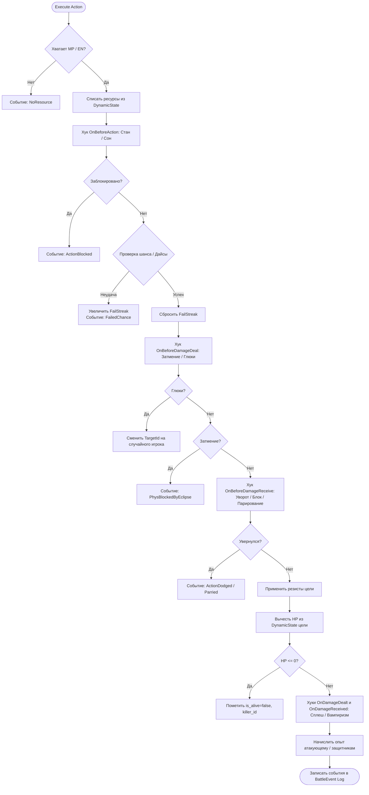

# Архитектурный план: Боевой движок на Rust с интеграцией в Bun (NAPI-RS)

Документ описывает архитектуру, структуру данных, боевой пайплайн на основе **Data-Oriented Design (DOD)** и план интеграции нативного Rust-ядра в существующий **Bun/TypeScript** сервер Fight World Online.

---

## 1. Концепция и Архитектурные принципы

### 1.1. Ключевые цели
- **Data-Oriented Design (DOD)**: строгое разделение на **неизменяемые определения (`PlayerDef`, `ActionDef`)** и **динамическое состояние (`DynamicState`, `BattleState`)**.
- **Бесшовная гибридная интеграция (Strangler Fig Pattern)**: бэкенд на Bun (Hono, Mongoose, Socket.IO, Telegram Bot) остаётся нетронутым, а расчёт раундов боя делегируется нативному Rust-модулю через **`napi-rs`**.
- **Абсолютная типобезопасность**: использование алгебраических типов (`enum` с данными) и исчерпывающего сопоставления с образцом (`match`) для всех боевых событий и результатов.
- **Stateless & Zero Cost**: отсутствие разделяемого мутируемого состояния и циклических ссылок; обращение к сущностям происходит по компактным индексам `PlayerId(u8)`.
- **Автоматическая генерация типов**: `napi-rs` генерирует готовые `.d.ts` файлы для TypeScript.

---

## 2. Архитектура интеграции с Bun

```
┌────────────────────────────────────────────────────────────────────────┐
│                        Bun Server (TypeScript)                         │
│                                                                        │
│   • Telegram Bot (grammy)             • Database (MongoDB / Mongoose) │
│   • API Routes (Hono)                 • WebSocket Server (Socket.IO)  │
│   • Lobby & Matchmaking               • Round Timers & Order Intake   │
└───────────────────────────────────┬────────────────────────────────────┘
                                    │
                         In-process Native Call
                         import { executeRound } from '@fwo/engine-rs'
                                    │
                                    ▼
┌────────────────────────────────────────────────────────────────────────┐
│                        Rust Engine (NAPI-RS)                           │
│                                                                        │
│   1. Validate Orders vs Defs                                          │
│   2. Execute Stages in Priority Sequence (Silence -> Buffs -> Phys)   │
│   3. Run Combat Pipeline (Pre-Hooks -> Resists -> HP -> Post-Hooks)    │
│   4. Age & Tick Affects (Round / Long / Passive)                      │
│   5. Emit Strongly-Typed Events (Damage, Heal, Block, Exp, Death)     │
└───────────────────────────────────┬────────────────────────────────────┘
                                    │
                       Returns: { next_state, events, is_game_end }
                                    │
                                    ▼
┌────────────────────────────────────────────────────────────────────────┐
│                        Bun Server (TypeScript)                         │
│   • Update Player Stats in Memory / DB                                 │
│   • Broadcast Events to Clients via Socket.IO                          │
│   • Check Game Over / Victory Conditions                               │
└────────────────────────────────────────────────────────────────────────┘
```

---

## 3. Структура проекта

```
fwo-tg/
├── client/                     # Фронтенд (React 19)
├── server/                     # Сервер (Bun + Hono + Socket.IO)
│   └── arena/
│       └── NativeEngine.ts     # Адаптер вызова Rust-модуля
├── shared/                     # Общие TypeScript типы
├── docs/                       # Документация и архитектурные планы
└── crates/
    └── engine-rs/              # Нативный Rust-крейт
        ├── Cargo.toml
        ├── build.rs
        ├── index.d.ts          # Автогенерируемые TS-декларации
        └── src/
            ├── lib.rs          # Точка входа NAPI-RS экспортов
            ├── domain/         # Чистые доменные типы
            │   ├── defs.rs     # Immutable PlayerDef, ActionDef, Resists
            │   ├── state.rs    # Mutable DynamicState, Affect, BattleState
            │   ├── order.rs    # Order, OrderTargetType
            │   └── events.rs   # Алгебраический enum BattleEvent
            ├── combat/         # Боевая математика и пайплайн
            │   ├── pipeline.rs # Шаги выполнения действия
            │   ├── damage.rs   # Расчёт урона и резистов
            │   ├── heal.rs     # Расчёт лечения
            │   └── exp.rs      # Расчёт и распределение опыта
            ├── actions/        # Реестр действий и конкретные скиллы
            │   ├── registry.rs # ActionRegistry и порядок стадий
            │   ├── attack.rs   # Базовая атака
            │   ├── protect.rs  # Защита и распределение урона
            │   ├── magics.rs   # Затмение, Глюки, Огненный шар...
            │   ├── skills.rs   # Уворот, Парирование, Разоружение...
            │   └── passives.rs # Размашистый удар, Кровотечение...
            ├── rng/            # Дайсы и псевдослучайность
            │   ├── dice.rs     # Парсер дайсов (1d80+20, 2d6)
            │   └── streak.rs   # Псевдо-RNG со стриками неудач
            └── round.rs        # Исполнитель стадий раунда
```

---

## 4. Спецификация структур данных на Rust (Data-Oriented)

### 4.1. Неизменяемые определения (`domain/defs.rs`)

```rust
use std::collections::HashMap;
use napi_derive::napi;

#[napi]
#[derive(Debug, Clone, Copy, PartialEq, Eq, Hash)]
pub struct PlayerId(pub u8);

#[napi(object)]
#[derive(Debug, Clone)]
pub struct WeaponDef {
    pub weapon_type: String, // "cut", "crush", "stab", etc.
    pub min_hit: f64,
    pub max_hit: f64,
}

#[napi(object)]
#[derive(Debug, Clone)]
pub struct PlayerDef {
    pub id: u8,
    pub nick: String,
    pub clan_id: Option<String>,
    pub weapon: WeaponDef,
    pub skills: HashMap<String, u8>,
    pub magics: HashMap<String, u8>,
    pub passives: HashMap<String, u8>,
    pub resists: HashMap<String, f64>,
    pub base_stats: HashMap<String, f64>,
}

#[napi(object)]
#[derive(Debug, Clone)]
pub struct BattleDefs {
    pub players: Vec<PlayerDef>,
}
```

---

### 4.2. Изменяемое состояние (`domain/state.rs`)

```rust
use std::collections::HashMap;
use napi_derive::napi;

#[napi(string_enum)]
#[derive(Debug, Clone, Copy, PartialEq, Eq)]
pub enum AffectType {
    Round,   // 1 раунд
    Long,    // N раундов (декрементится каждый раунд)
    Passive, // Постоянный эффект
}

#[napi(object)]
#[derive(Debug, Clone)]
pub struct Affect {
    pub action_key: String,
    pub initiator_id: u8,
    pub affect_type: AffectType,
    pub duration: u32,
    pub value: f64,
    pub proc: f64,
}

#[napi(object)]
#[derive(Debug, Clone, Default)]
pub struct DynamicState {
    pub hp: f64,
    pub mp: f64,
    pub energy: f64,
    pub exp_earned: u32,
    pub is_alive: bool,
    pub killer_id: Option<u8>,
    pub fail_streaks: HashMap<String, u32>,
    pub affects: Vec<Affect>,
}

#[napi(object)]
#[derive(Debug, Clone)]
pub struct BattleState {
    pub players: Vec<DynamicState>,
    pub round: u32,
    pub no_damage_streak: u32,
}
```

---

### 4.3. События боя (`domain/events.rs`)

```rust
use napi_derive::napi;

#[napi(object)]
#[derive(Debug, Clone)]
pub struct BattleEvent {
    pub event_type: String, // "damage", "heal", "blocked", "dodged", "redirected", "death", "exp"
    pub initiator_id: u8,
    pub target_id: u8,
    pub action_key: String,
    pub value: f64,
    pub reason: Option<String>,
    pub target_hp_left: Option<f64>,
}
```

---

### 4.4. Точка входа NAPI (`src/lib.rs`)

```rust
use napi_derive::napi;
use crate::domain::{defs::BattleDefs, state::BattleState, order::Order, events::BattleEvent};

#[napi(object)]
pub struct RoundInput {
    pub defs: BattleDefs,
    pub state: BattleState,
    pub orders: Vec<Order>,
}

#[napi(object)]
pub struct RoundOutput {
    pub next_state: BattleState,
    pub events: Vec<BattleEvent>,
    pub is_game_end: bool,
    pub end_reason: Option<String>,
}

#[napi]
pub fn execute_round(input: RoundInput) -> RoundOutput {
    round::execute_round_stages(input.defs, input.state, input.orders)
}
```

---

## 5. Боевой пайплайн (Combat Pipeline Flow)



---

## 6. План реализации по фазам

| Фаза | Модуль | Описание задач |
|---|---|---|
| **Фаза 1: Сборка и NAPI Setup** | `crates/engine-rs` | - Настройка `Cargo.toml`, `napi-rs` CLI и конфигурации сборки.<br>- Скрипты компиляции в `package.json` Bun-проекта.<br>- Простой "Hello World" round trip вызов из TypeScript в Rust. |
| **Фаза 2: Доменные модели и RNG** | `domain/` & `rng/` | - Структуры `PlayerDef`, `DynamicState`, `BattleState`, `Affect`, `Order`.<br>- Парсер дайсов (`dice.rs`) и алгоритм псевдорандома со стриками (`streak.rs`).<br>- Unit-тесты дайсов и генератора вероятностей на Rust. |
| **Фаза 3: Боевой пайплайн** | `combat/` | - Логика списания ресурсов (`mp`, `en`).<br>- Расчёт урона с учётом модификаторов атаки, дайсов оружия и сопротивлений цели.<br>- Пайплайн лечения (`heal.rs`) и распределения опыта (`exp.rs`).<br>- Генератор событий `BattleEvent`. |
| **Фаза 4: Реализация скиллов и магий** | `actions/` | - Базовая атака и защита (`attack.rs`, `protect.rs`).<br>- Физические скиллы (`dodge.rs`, `parry.rs`, `disarm.rs`, `shieldBlock.rs`).<br>- Магии контроля (`eclipse.rs`, `glitch.rs`, `madness.rs`, `paralysis.rs`).<br>- Боевая магия (`fireball.rs`, `magicArrow.rs`, щиты `lightShield.rs`, `magicWall.rs`).<br>- Пассивные умения (`sweepingBlow.rs`, `lacerate.rs`, `nineLives.rs`). |
| **Фаза 5: Раундовый цикл и стадии** | `round.rs` | - Выполнение стадий по порядку (Silence &rarr; Buffs &rarr; Control &rarr; Skills &rarr; Phys &rarr; Magic &rarr; Heals).<br>- Старение и очистка аффектов (`affect.duration--`).<br>- Проверка условий победы (`is_game_end`, `no_damage_streak`). |
| **Фаза 6: Интеграция с Bun сервером** | `server/arena/` | - Написание TypeScript адаптера `NativeEngine.ts`.<br>- Конвертация `GameService` &rarr; `RoundInput` и обратно `RoundOutput` &rarr; `GameService`.<br>- Режим теневого тестирования (**Shadow Mode**): параллельный прогон раунда на TS и Rust со сверкой логов. |
| **Фаза 7: Бенчмарки и стабилизация** | Тесты | - Бенчмарки Rust-ядра (цель: >100 000 раундов в секунду).<br>- Полное переключение флага в продакшене с TS на нативный Rust. |

---

## 7. Верификация и стратегия тестирования

1. **Тесты в Rust**:
   ```bash
   cd crates/engine-rs
   cargo test -- --nocapture
   cargo bench
   ```
2. **Тесты интеграции в Bun**:
   ```bash
   bun run build:engine   # Сборка нативного модуля .node
   bun test server/       # Тесты TypeScript сервера с нативным модулем
   ```
3. **Shadow Mode (Теневая верификация в бою)**:
   ```typescript
   // Временный код в GameService для 100% гарантии:
   const tsResult = runLegacyTSEngine(game);
   const rustResult = executeRound(game.toRoundInput());
   
   if (!deepEqual(tsResult.events, rustResult.events)) {
     console.error("Mismatch detected between TS and Rust engine!");
   }
   ```
